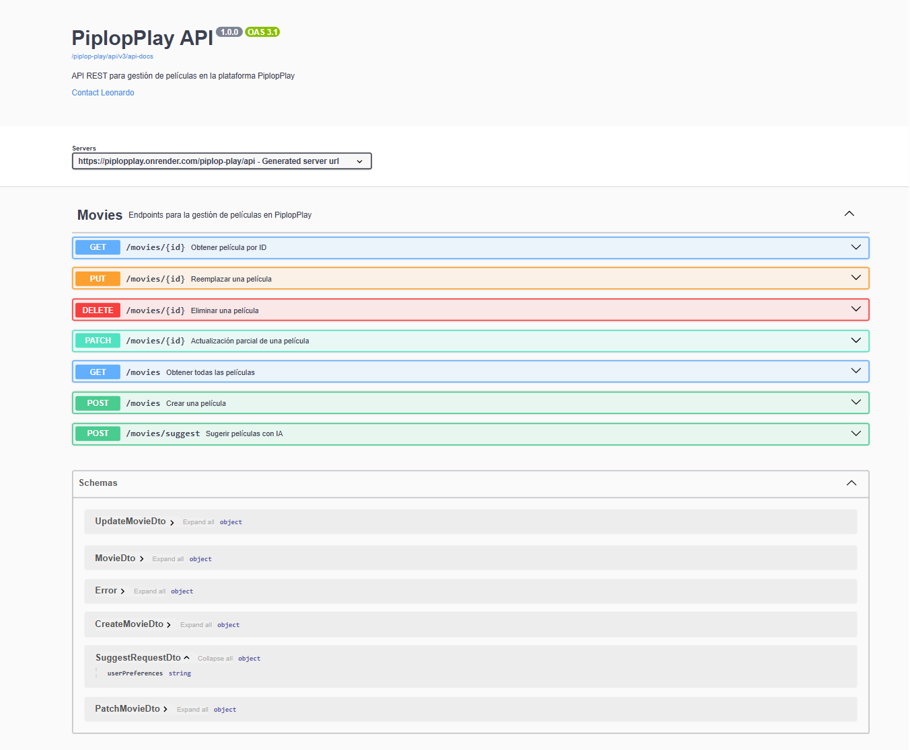

# 🎬 PiplopPlay API

API REST para la gestión de películas de la plataforma PiplopPlay, desarrollada con Spring Boot 4 y desplegada en Render.



## 🌐 Demo en vivo

| Recurso | URL |
|---|---|
| API | https://piplopplay.onrender.com/piplop-play/api/movies |
| Documentación Swagger | https://piplopplay.onrender.com/piplop-play/api/swagger-ui/index.html |

> ⚠️ El servidor puede tardar unos segundos en responder si estuvo inactivo (Render free tier).

---

## 🚀 Tecnologías

- **Java 21**
- **Spring Boot 4**
- **Spring Data JPA** — persistencia y acceso a datos
- **PostgreSQL** — base de datos relacional
- **MapStruct** — mapeo entre entidades y DTOs
- **LangChain4j + OpenAI** — sugerencias de películas con IA
- **Springdoc OpenAPI 3 (Swagger)** — documentación interactiva
- **Docker** — contenerización para el despliegue
- **JUnit 5 + Mockito** — tests unitarios y de integración

---

## 📋 Endpoints

| Método | Endpoint | Descripción |
|---|---|---|
| `GET` | `/movies` | Obtener todas las películas |
| `GET` | `/movies/{id}` | Obtener película por ID |
| `POST` | `/movies` | Crear una película |
| `PUT` | `/movies/{id}` | Reemplazar una película completa |
| `PATCH` | `/movies/{id}` | Actualización parcial de una película |
| `DELETE` | `/movies/{id}` | Eliminar una película |
| `POST` | `/movies/suggest` | Sugerir películas con IA según preferencias |

---

## 📦 Ejemplo de respuesta

```json
{
  "id": 1,
  "title": "Inception",
  "duration": 148,
  "genre": "SCI_FI",
  "releaseDate": "2010-07-16",
  "rating": 4.8,
  "status": "AVAILABLE"
}
```

---

## ⚙️ Correr el proyecto localmente

### Prerrequisitos
- Java 21
- Docker (para la base de datos)
- Gradle

### Pasos

1. Clona el repositorio:
```bash
git clone https://github.com/piplop1/piplop-play.git
cd piplop-play
```

2. Crea un archivo `.env` en la raíz del proyecto basándote en `.env.example`:
```env
DB_URL=jdbc:postgresql://localhost:5432/piplop_play_db
DB_USERNAME=tu_usuario
DB_PASSWORD=tu_password
OPENAI_API_KEY=tu_api_key
```

3. Inicia la base de datos con Docker:
```bash
docker compose up -d
```

4. Corre el proyecto:
```bash
./gradlew bootRun
```

5. Accede a Swagger en: `http://localhost:8090/piplop-play/api/swagger-ui/index.html`

---

## 🧪 Tests

```bash
./gradlew test
```

El proyecto cuenta con tests unitarios para la capa de servicio y tests de integración para los endpoints HTTP.

---

## 📁 Estructura del proyecto

```
src/
├── main/
│   └── java/com/piplop/play/
│       ├── domain/
│       │   ├── dto/          # DTOs (CreateMovieDto, PatchMovieDto, UpdateMovieDto...)
│       │   ├── exceptions/   # Excepciones de negocio
│       │   ├── repository/   # Interfaces del dominio
│       │   └── services/     # Lógica de negocio
│       ├── persistence/
│       │   ├── entity/       # Entidades JPA
│       │   ├── mapper/       # Mappers MapStruct
│       │   └── crud/         # Repositorios Spring Data
│       └── web/
│           ├── controller/   # Controllers REST
│           └── exception/    # Manejo global de excepciones
└── test/                     # Tests unitarios y de integración
```

---

## 👤 Autor

**Leonardo** — [@piplop1](https://github.com/piplop1)
